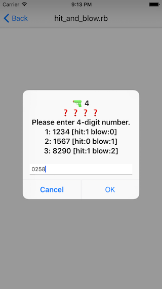

# Hit & Blow
Hit and Blow Game

## Rule
- It is a game to hit a 4-digit number
- You answer 4 digit numbers
- Computer will tell you the number of hits and blows as a hint
   - Hit: Both number and digit position are the same
   - Blow: Number is same but digit position is different
- Let's answer with as few answers as possible!

## ルール
- 4桁の数字を当てるゲームです
- 回答者は4桁の数字を答えます
- コンピュータはヒントとしてヒットとブローの数を教えてくれます
  - ヒット: 数と桁位置が両方同じ数字の数
  - ブロー: 数が同じで桁位置が違う数字の数
- より少ない回答数で正解を当てましょう
